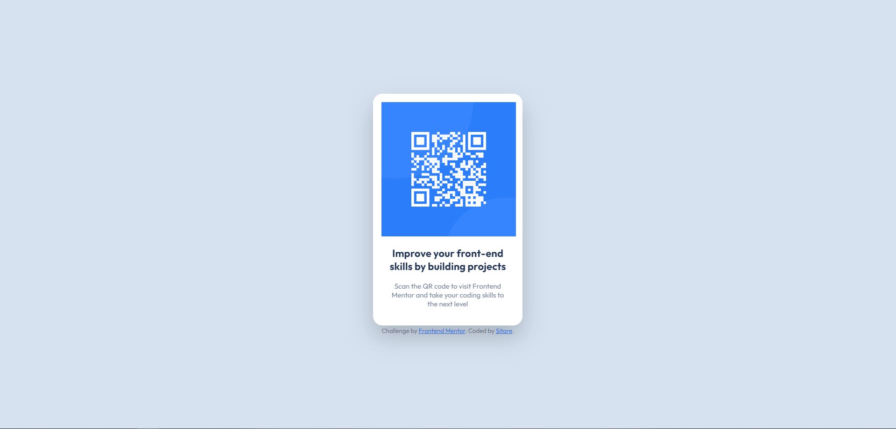

# Frontend Mentor - QR code component solution

This is a solution to the [QR code component challenge on Frontend Mentor](https://www.frontendmentor.io/challenges/qr-code-component-iux_sIO_H).

## Table of contents

  - [Overview](#overview)
  - [Screenshot](#screenshot)
  - [Links](#links)
  - [My process](#my-process)
  - [Built with](#built-with)
  - [What I learned](#what-i-learned)
  - [Continued development](#continued-development)


## Overview

### Screenshot




### Links

- Solution URL: [Repository URL](https://your-solution-url.com)
- Live Site URL: [Live Site URL](https://msa-sitare.github.io/qr-code-component/)


## My process

### Built with

- Semantic HTML5 markup
- CSS custom properties
- CSS Grid


### What I learned

I've just starting coding. I try my best to use semantically correct HTML elements. I learned "small" element from one of youtube videos, I'm happy that I remembered to use it for copyright. Though I read that "footer" element would be enough for copyright, so maybe I'm overdoing while trying to use semantic code. I haven't learned CSS Flexbox or Grid yet, so it was such a hussle trying to center the card. Now I understand center the div jokes.

```html
<footer>
  <small>Challenge by <a href="https://www.frontendmentor.io?ref=challenge" target="_blank">Frontend Mentor</a>. 
  Coded by <a href="https://github.com/msa-sitare/qr-code-component">Sitare</a>.</small>
</footer>
```
```css
body {
  display: grid;
  place-items: center;
}
```


### Continued development

I want to fix the footer element to the bottom, I think I can manage it after learning flexbox & grid.
